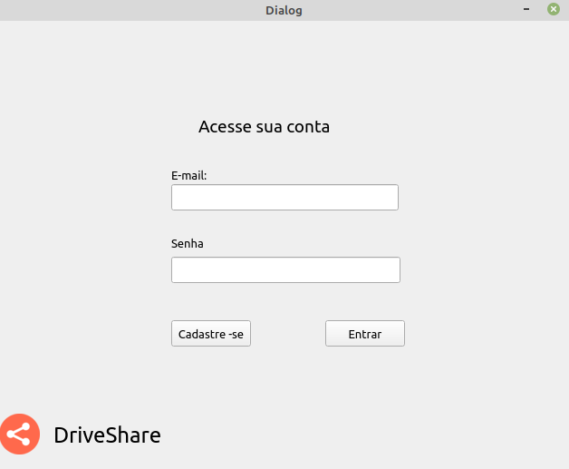
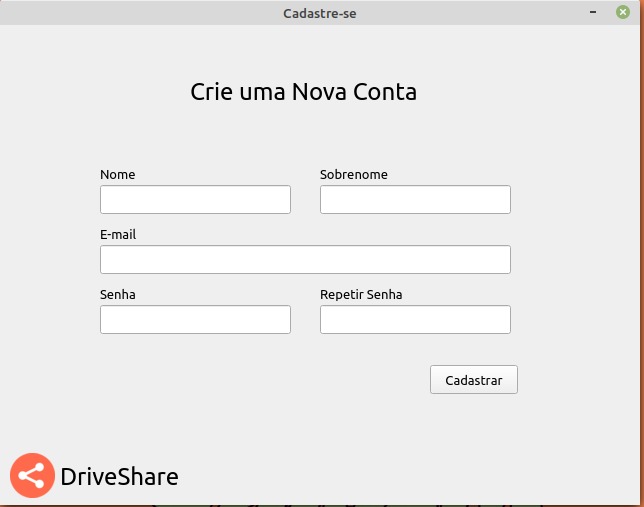
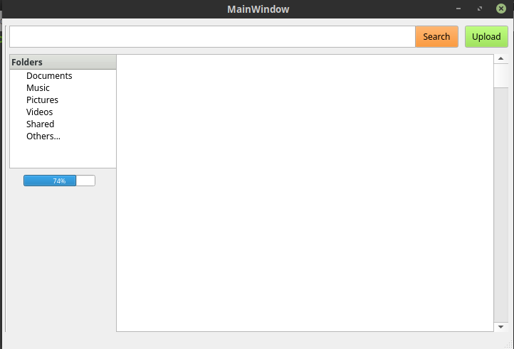
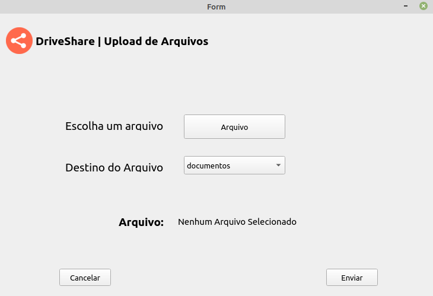
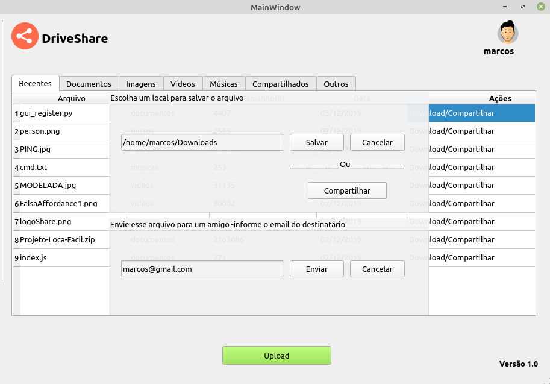

# DriveShare
Plataforma para compartilhamento e backup de arquivos

# Descrição
A plataforma implementada destina-se a realização de uploads de arquivos para um servidor remoto, com o intuito de realizar o backup e o compartilhamento de qualquer arquivo. O DriveShare permite que o usuário mainipule os arquivo enviados para a plataforma, onde é possível visualizar todos os arquivos upados, controlar o destino de cada upload, fazer o download de arquivos e compartilhar-los.
# Como usar
1 - Clone o repositório para sua máquina local;

2 - Clone o repositório do servidor e o execute na máquina remota (https://github.com/barretoMarcosPaulo/server-DriveShare);

3 - Instale a biblioteca pyqt5 no cliente;

4 - Instale a biblioteca pymysql no servidor e crie o banco de dados segundo o arquivo database.sql em https://github.com/barretoMarcosPaulo/server-DriveShare/database.sql;

5 - Execute o arquivo <strong>server.py</strong> para executar o servidor;

6 - Execute o arquivo <strong>app.py</strong> no arquivo do client side.

# Funcionalidades
1 - Login de usuário e registro de sessão por meio de email e senha;

2 - Cadastro de novos usuários;

3 - Listagens dos arquivos enviados, por categoria;

5 - Uploads de arquivos;

6 - Download de arquivos;

7 - compartilhamento de arquivos com outros usuário.

# Registration Screen

