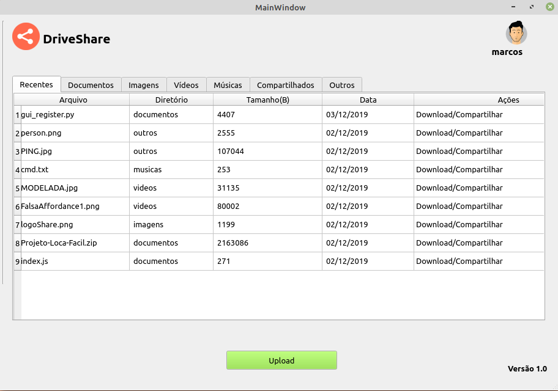

# DriveShare
platform for file uploads

# Description
Tool implemented in python3 for file uploads. The tool has user registration, authentication, sharing and file uploads functionality.
# How to use
1 - Clone this repository

2 - Download the code server side in repository (https://github.com/barretoMarcosPaulo/server-DriveShare)

3 - Install the library pyqt

4 - Install python3 and pyqt5

# Registration Screen

